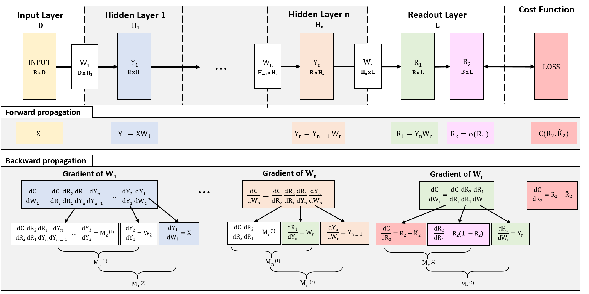
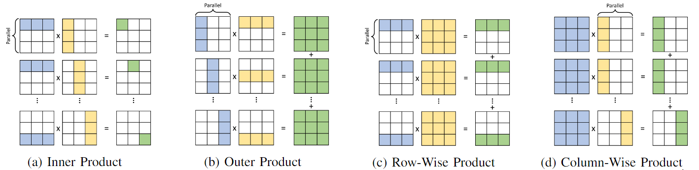

# Feed-forward Neural Network (FNN) Pipeline With Parallel Low-Dimensional Matrix Multiplications

  
   
   
  

  

  
   
   
  

This is the C++ parallel implementation of the Feed-forward Neural Network (FNN) pipeline used in link prediction and node classification tasks in the ICCD 2022 paper "Towards Real-time Execution of Spatio-Temporal Graph Learning". The individual matrix kernels in the forward and backward propagation steps of FNN training are implemented for in-depth performance analysis. 

We implement four state-of-the-art parallelization strategies for the low-dimensional matrix-multiplications in the FNN pipeline to evaluate the performance scaling potential on multicore processors:

(1) Inner-wise multiplication

(2) Outer-wise multiplication

(3) Row-wise multiplication

(4) Column-wise multiplication

Running Instructions
-----------
Compile the code using
`g++ link_prediction.cpp -lpthread -O3` for the link prediction FNN or `g++ node_classification.cpp -lpthread -O3` 
for the node classification FNN.

Run `./a.out <threads> <mul_function>`

<mul_function> : 0-Inner, 1-Row-wise, 2-Col-wise, 3-Outer`
